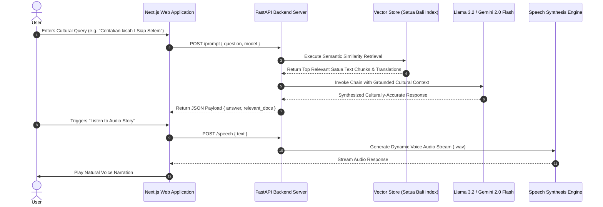
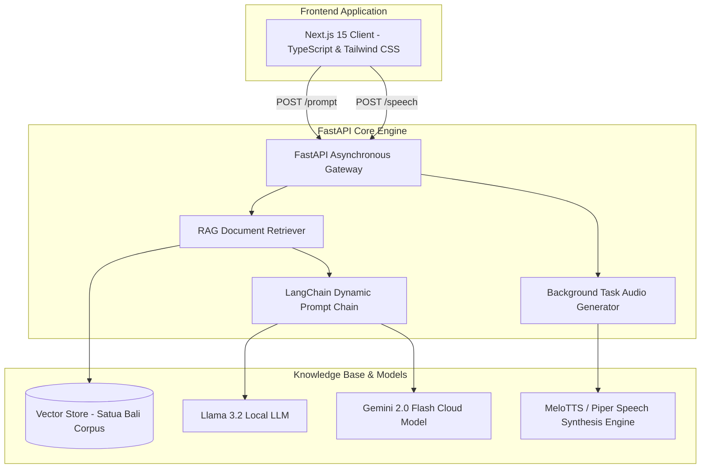

## Overview

**BarongAI** is a cultural intelligence platform and conversational AI assistant engineered to preserve, translate, and explore Balinese literature and folklore (_Satua Bali_). By pairing a semantic vector retriever with multi-model LLM generation and real-time speech synthesis, BarongAI provides culturally grounded answers, historical context, and automated story narrations in both Balinese and Indonesian.

---

## RAG & Speech Synthesis Pipeline

The system bridges user exploration with authentic cultural knowledge by routing queries through a semantic vector store before invoking large language models. The sequence below outlines the retrieval-augmented generation lifecycle alongside asynchronous voice synthesis streaming.

This pipeline ensures that AI answers remain grounded in authenticated historical literature rather than hallucinated generalizations. Audio narration is streamed on-demand using background worker threads to keep interface interactions fluid and responsive.

---

## System Infrastructure Topology

BarongAI is architected with a decoupled Next.js web application interfacing with an asynchronous FastAPI backend service that orchestrates vector retrievers, multi-LLM endpoints, and speech generation engines.

By decoupling retrieval mechanics from speech generation, the architecture supports high concurrent user sessions without GPU inference bottlenecks. Dynamic model switching allows users to select between local privacy-first inference or cloud-accelerated reasoning on demand.

---

## Key Architectural Decisions

- **Specialized Cultural Vector Index**: Curated and indexed a bilingual corpus of authentic Balinese folklore (_Satua Bali_), ensuring LLM responses are grounded in legitimate cultural narratives rather than generic hallucinations.
- **Dynamic Dual-Model Routing**: Engineered runtime model switching between local edge models (Llama 3.2) and cloud APIs (Gemini 2.0 Flash) to balance privacy and reasoning performance.
- **Asynchronous Audio Streaming**: Utilized FastAPI background tasks to synthesize voice narrations on-the-fly, returning streamed WAV responses with automated temporary file cleanup.
- **Bilingual Translation Alignment**: Structured LangChain prompt templates to seamlessly cross-reference Balinese dialect idioms with standard Indonesian and English translations.
