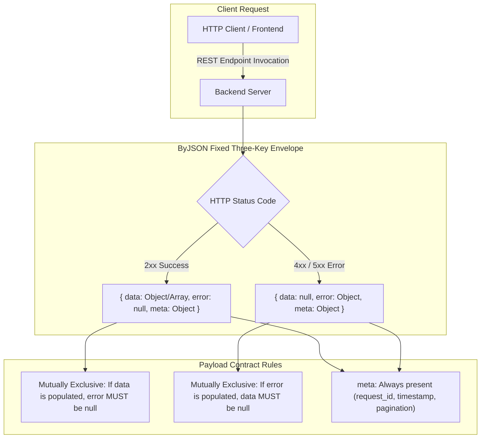

## Overview

**ByJSON** (_"Connected by JSON, structured ByJSON"_) is an open REST API payload specification created to eliminate structural inconsistencies between backend services and client applications. Positioned between over-engineered protocols like JSON:API and overly minimal conventions like JSend, ByJSON enforces a strict, predictable contract where **every response always contains exactly three root keys: `data`, `error`, and `meta`**.

---

## Response Envelope Architecture

ByJSON establishes an unambiguous response envelope regardless of the HTTP verb or outcome status. The diagram below illustrates how client requests branch deterministically into mutually exclusive data or error states while consistently providing metadata context.



This rigid structural guarantee allows frontend developers and mobile engineers to write universal HTTP interceptors with zero runtime type ambiguity. Success payloads cleanly expose resources while failure payloads deliver structured diagnostics without dropping diagnostic request metadata.

---

## Standardized Payload Examples

### 1. Paginated Success Response (HTTP 200)

All successful operations populate `data`, keep `error` as `null`, and supply context inside `meta`:

```json
{
  "data": [
    {
      "id": 101,
      "name": "Bayu Pratama",
      "role": "systems_architect",
      "is_active": true
    }
  ],
  "error": null,
  "meta": {
    "request_id": "c138d4e2-629b-4e89-b8e7-df9b43eb72cd",
    "timestamp": "2026-08-14T22:00:00Z",
    "pagination": {
      "current_page": 1,
      "per_page": 10,
      "total_items": 45,
      "total_pages": 5,
      "links": {
        "self": "https://api.domain.com/users?page=1&per_page=10",
        "next": "https://api.domain.com/users?page=2&per_page=10",
        "prev": null
      }
    }
  }
}
```

### 2. Fine-Grained Validation Error Response (HTTP 422)

All failed operations set `data` to `null`, populate `error` using `snake_case` codes, and retain debugging `meta`:

```json
{
  "data": null,
  "error": {
    "code": "validation_error",
    "message": "The request data is invalid. Please check your input.",
    "details": [
      {
        "field": "email",
        "code": "invalid_format",
        "message": "The email must be a valid email address format."
      },
      {
        "field": "/shipping_address/postal_code",
        "code": "missing_field",
        "message": "Postal code is required for physical deliveries."
      }
    ]
  },
  "meta": {
    "request_id": "e4f8101a-9c71-4b12-88d4-53fb1628d091",
    "timestamp": "2026-08-14T22:00:00Z"
  }
}
```

---

## Key Specification Principles

- **Guaranteed Three Root Keys**: Every response (whether success or error) **MUST** contain `data`, `error`, and `meta`. Client HTTP interceptors can parse all incoming responses with zero conditional envelope discovery.
- **Strict Mutual Exclusivity**: If `data` is populated, `error` **MUST** be `null`. If `error` is populated, `data` **MUST** be `null`.
- **Meta Context Everywhere**: The `meta` object is mandatory across all responses, consistently providing auditability via `request_id`, ISO-8601 UTC `timestamp`, and pagination cursors/offsets.
- **Consistent `snake_case` Conventions**: All JSON keys and error codes adhere strictly to `snake_case`, mirroring relational database and cloud standard conventions.
- **Structured File Resource Contract**: Standardized conventions for multipart uploads, direct cloud streaming, and presigned URLs (S3/GCS) with orphan cleanup policies.
- **Language Agnostic Implementation**: Frictionless adoption across NestJS, Express, Go, Python FastAPI, and frontend HTTP libraries.
