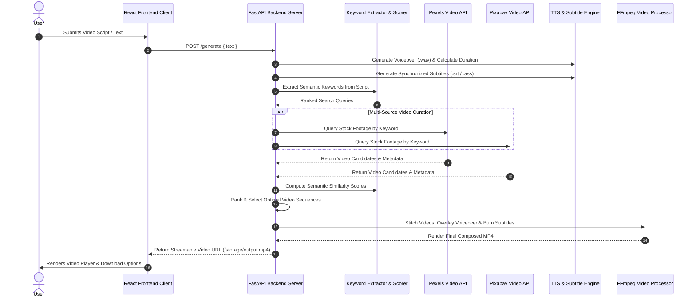
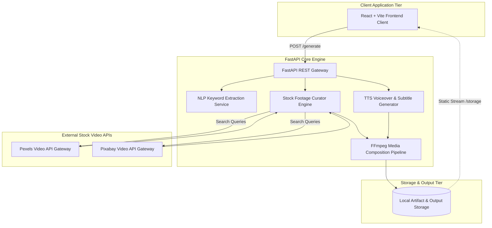

## Overview

**Flikee** is an automated video synthesis and stock footage curation platform engineered to transform raw text scripts into fully produced, narrated short-form videos. Built with a **FastAPI** backend and **React** frontend, Flikee automates the complete multi-stage video production pipeline: NLP keyword extraction, multi-source footage querying from **Pexels** and **Pixabay**, semantic relevance scoring, automated text-to-speech (TTS) voiceover, and synchronized dynamic subtitle rendering.

---

## Video Generation & Curation Pipeline

The core generation pipeline processes raw script inputs through parallel asset fetching and sequential media stitching. The sequence diagram below traces the end-to-end flow from keyword analysis to final MP4 composition.

Through automated parallel querying across Pexels and Pixabay, Flikee maximizes visual variety while selecting clips based on semantic alignment with the generated voiceover timeline. FFmpeg processes transitions, audio normalization, and dynamic subtitle burning in a single consolidated rendering pass.

---

## System Infrastructure Topology

Flikee separates lightweight client-side script authoring from resource-intensive media processing microservices.

This decoupled architecture allows the FastAPI server to process media tasks independently without blocking client user interfaces. Temporary audio stems, downloaded video segments, and final renders are partitioned in isolated timestamped storage buckets for automatic cleanup.

---

## Key Architectural Decisions

- **Multi-Source Footage Curation**: Integrated both **Pexels API** and **Pixabay API** to broaden stock video coverage, eliminating visual repetition across generated clips.
- **Semantic Similarity Scoring**: Implemented text-similarity algorithms comparing video descriptions and metadata against script keywords to guarantee contextually relevant footage selection.
- **Automated Voiceover & Subtitle Synchronization**: Aligned Text-to-Speech (TTS) audio timestamps with subtitle cue generators, ensuring word-by-word subtitle display matches spoken pacing precisely.
- **Efficient Video Assembly Pipeline**: Orchestrated video concatenation, audio mixing, resolution scaling, and hardcoded subtitle overlays through an optimized FFmpeg processing pipeline.
- **FastAPI Asynchronous Architecture**: Leveraged asynchronous request handling and isolated disk storage namespaces to execute multi-step rendering pipelines cleanly.
