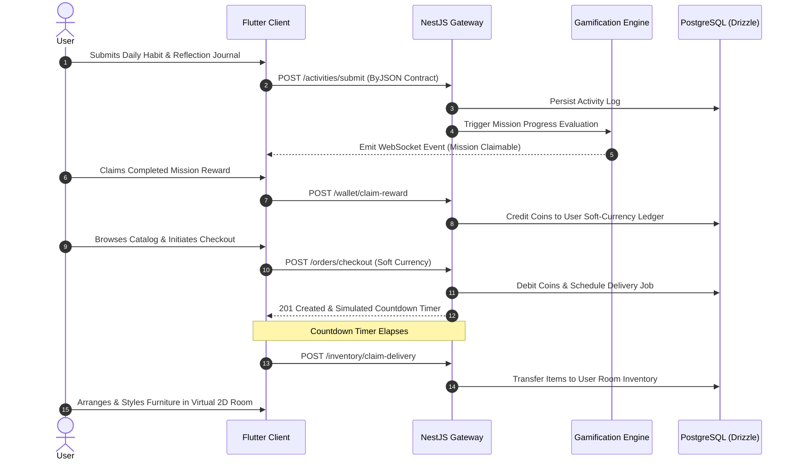
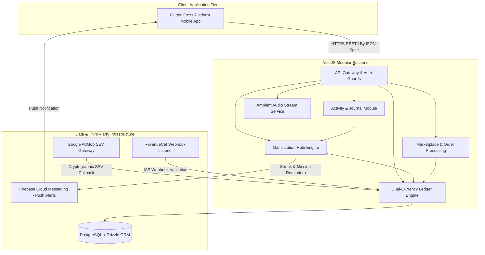

## Overview

**Kaimify** is a holistic mobile wellness and behavioral harm-reduction platform engineered to redirect compulsive shopping behaviors (_oniomania_) into constructive, therapeutic daily routines. Grounded in a **harm-reduction** framework, the application reproduces the complete emotional arc of e-commerce (browsing dynamic catalogs, discount hunting, checkout, delivery countdowns, unboxing, and room decorating) without exposing users to real-world financial risk.

Healthy behavioral routines (daily mood journaling, habit tracking, mindfulness readings, breathwork sessions, and Pomodoro focus timers) serve as the sole engine driving the closed-loop virtual economy.

---

## 1. Core Feature & Modular Architecture

Kaimify is structured around six cohesive functional modules spanning client-side interactive tooling and backend transactional services:

### 🧘 Activity & Mindfulness Engine

- **Mood-Based Daily Journals**: Interactive mood logging across 5 emotional states (_Ecstatic, Happy, Neutral, Sad, Terrible_) paired with an **Emotional Feedback Shelf**, dynamic tagging (`#Grateful`, `#Work`, `#Reflection`), and instant full-text search.
- **Mindful Tag Graph**: Interactive **Force-Directed Graph** visualizing non-linear correlations between daily moods, tagged contexts, and completed wellness activities with bottom-sheet analytical insights.
- **Habit Tracker & Task Manager**: Customizable daily and weekly habit schedules with quick check-offs, priority matrices (_Low, Medium, High, Urgent_), and time-bounded task execution.
- **Mindful Readings**: Curated library of philosophy, mental wellness, and mindfulness literature supporting single articles and multi-chapter books with dedicated Reader Mode.
- **Custom Meditation & Breathwork**: Guided multi-phase breathing (_Inhale, Hold, Exhale_) with custom user voice recording uploads, ambient guidance, and vector wave animations.
- **Focus & Ice Timers**: Dual-mode productivity companion featuring customizable Pomodoro timers (25m, 50m, custom) and specialized breath retention timers with cold-exposure wave canvases.

### 🏆 Gamification & Retention Progression

- **Streak Tracker & Milestones**: Daily consistency monitoring with weekly progress heatmaps and longest-streak record milestones.
- **Midnight-Reset Daily Missions**: Automated mission rotations granting Coins and Gems upon completing daily reflection targets.
- **Tiered Achievement Badges**: Multi-tier progression badges (_Bronze, Silver, Gold, Platinum_) honoring milestones in wellness consistency, economic accumulation, and room styling.

### 🏡 Sanctuary / 2D Virtual Room Canvas

- **Interactive Room Editor**: Spatial 2D canvas enabling affine transformations (rotation, scaling, horizontal mirroring, and z-index ordering) for purchased virtual furniture, rugs, wallpapers, and botanical decor.
- **Persistent Inventory Vault**: Real-time asset storage syncing user-owned furniture configurations across devices.

### 🛒 Marketplace & Dual-Currency Virtual Economy

- **Dual-Currency Wallet**: Anti-race-condition ledger partitioning free **Coins** (strictly earned through wellness activities) from **Gems** (awarded via milestones and verified ads).
- **Catalog, Cart & Instant Checkout**: Full e-commerce simulation with wishlist support, flash-sale discount countdowns, and race-condition-safe cart checkouts.
- **Rewarded Ads with Server-Side Verification (SSV)**: Google AdMob integration verifying reward eligibility via cryptographic server callbacks.

### 🎵 Ambient Soundscape & Multi-Theme Engine

- **Built-in Ambient Audio Player**: Background soundscape engine streaming Lofi, Nature Ambience, White Noise, and Deep Meditation audio tracks during active journaling or focus sessions.
- **Adaptive Multi-Theme Engine**: Dynamic runtime switching across **5 distinct visual design languages** (_Neobrutalism, Flat, Minimalist, Glassmorphism, Material 3_) in both Dark and Light modes.

---

## 2. Behavioral Loop & Transactional Workflow

The core operational loop directly translates verified wellness completions into virtual purchasing power. The sequence below demonstrates the flow from daily activity submission to mission evaluation, currency crediting, order checkout, and room inventory transfer.

This sequence guarantees that virtual shopping retains emotional satisfaction through artificial delivery countdowns and unboxing rituals. Users fulfill shopping impulses harmlessly while reinforcing positive mindfulness habits.

---

## 3. System Architecture & Service Topology

Kaimify employs a decoupled microservices-inspired architecture designed for high-concurrency event handling, real-time WebSocket state broadcasting, and tamper-proof ledger transactions.

This modular topology isolates ledger state mutations from external webhook listeners, guaranteeing transactional integrity. Drizzle ORM enforces end-to-end type safety between relational PostgreSQL tables and application domain services.

---

## Key Architectural Decisions

- **Harm-Reduction Economic Design**: Engineered a dual-currency closed-loop ledger. Soft currency (_Coins_) is non-purchasable with fiat and strictly earned via wellness activities, preserving the therapeutic integrity of the simulation.
- **Server-Side Ad Verification (SSV)**: Integrated Google AdMob with cryptographic server-side callback verification, guaranteeing reward tokens cannot be spoofed by client-side tampering.
- **Modular Clean Architecture**: Developed the backend using NestJS, Drizzle ORM, and PostgreSQL, adhering strictly to the **ByJSON** API response format for predictable error handling and data deserialization.
- **Spatial Room Customizer**: Built an optimized 2D canvas room layout engine in Flutter supporting affine transformations (rotation, scaling, horizontal mirroring, and z-index ordering) with real-time state persistence.
- **Dynamic Multi-Theme Engine**: Built an extensible theming architecture in Flutter supporting runtime swaps between Neobrutalism, Flat, Minimalist, Glassmorphism, and Material 3 design systems.
