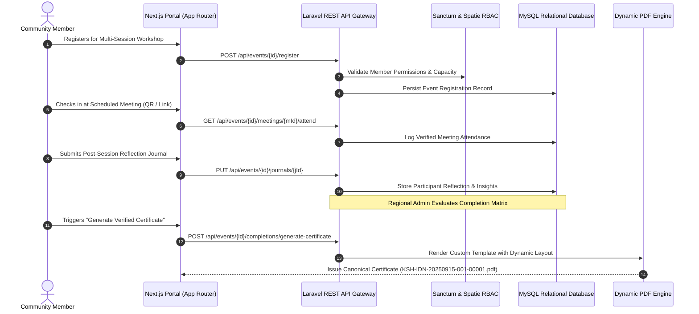
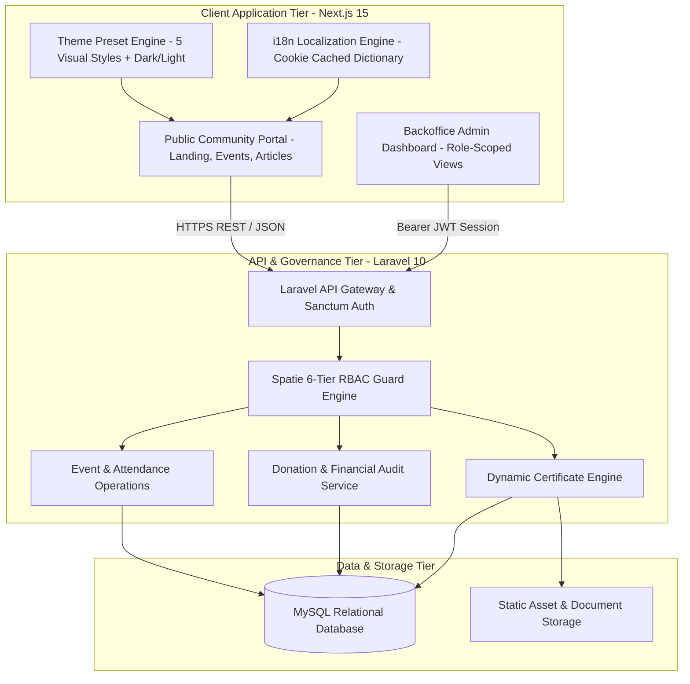

## Overview

**Kelompok Setia Hati (KSH)** is an enterprise-scale community governance, spiritual wellness workshop management, and donation transparency platform engineered to support global community chapters. Built with a decoupled architecture pairing a **Next.js 15** frontend client with a high-performance **Laravel 10** REST API, KSH coordinates event lifecycles, attendance tracking, mentor-guided reflection journals, automated certificate issuance, and regional donation ledgers.

---

## Event Lifecycle & Automated Certification Workflow

The platform streamlines the operational journey from initial attendee registration and live session check-ins to mentor evaluations and verifiable PDF certificate generation. The sequence below traces this end-to-end lifecycle.

By standardizing attendance thresholds and mandatory journal reflections, the platform guarantees that certificates are only issued to verified attendees. The PDF generation engine formats layout coordinates dynamically based on per-event configuration templates stored in the database.

---

## Multi-Region System Architecture

Kelompok Setia Hati coordinates decentralized international chapters through a hierarchical structure (`Region` -> `Country` -> `City`), granting localized administration while preserving global auditability.

This decoupled topology allows regional administrators to manage localized content, financial records, and event schedules independently. Cookie-cached data dictionaries enable instant multilingual switching across English and Indonesian without redundant API roundtrips.

---

## Key Architectural Decisions

- **6-Tier Role-Based Access Control (RBAC)**: Enforced strict permission boundaries across `super_admin`, `regional_admin`, `editor`, `mentor`, `member`, and `alumni` roles using Spatie Laravel Permission.
- **Dynamic Certificate Numbering Standard**: Implemented an automated serial certificate generator enforcing canonical naming schemes: `KSH-{COUNTRYCODE}-{YYYYMMDD}-{EVENTID_PADDED}-{COMPLETIONID_PADDED}`.
- **Database-Backed i18n Localization**: Built a dynamic multi-language dictionary stored in MySQL with cookie-backed caching on the Next.js client, enabling non-technical admins to update copy in real time.
- **Adaptive 5-Preset Theming System**: Engineered a versatile design system in Next.js supporting _Default, Modern, Brutalist, Soft-Pop, and Twitter_ visual themes with seamless Light/Dark mode toggling.
- **Regional Financial & Donation Transparency**: Partitioned donation centers by geographical territory, recording multi-currency inflows, admin confirmations, and cash flow reports for complete fiscal accountability.
