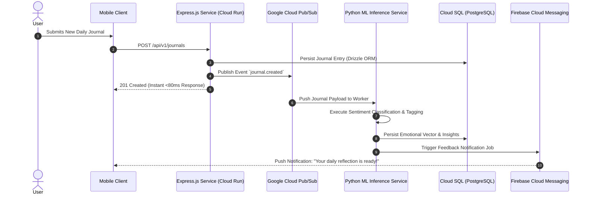

## Overview

**Memotions** is an event-driven mental wellness and journaling platform engineered to facilitate daily self-reflection through machine learning-driven emotional feedback and retention gamification. Developed as the final Capstone project for **Bangkit Academy**, Memotions features a cloud-native microservices architecture deployed on Google Cloud Platform, balancing low-latency API responses with asynchronous machine learning processing.

---

## Event-Driven Asynchronous Pipeline

To deliver instantaneous mobile user response times while supporting compute-heavy ML text embeddings, Memotions decouples journal writes from sentiment classification. The sequence below illustrates the asynchronous event publishing and background worker lifecycle.



This asynchronous decoupling guarantees API response latencies below 80ms regardless of machine learning model execution duration. Push notifications asynchronously alert users once deep sentiment scoring, thematic tagging, and gamification streaks are calculated.

---

## Cloud Infrastructure Topology

Memotions is deployed as a resilient, auto-scaling microservice cluster on Google Cloud Platform. The topology below traces network requests from global Cloud Load Balancers through backend compute services, message queues, and managed databases.

```mermaid
graph TD
    subgraph Client Tier
        A[Mobile Application]
    end

    subgraph Google Cloud Platform (GCP)
        B[Cloud Load Balancer]
        C[Cloud Run - Express REST Backend]
        D[Cloud Pub/Sub Messaging Queue]
        E[Cloud Run - Python ML Worker]
        F[(Cloud SQL - PostgreSQL)]
        G[Cloud Storage - Static Media Assets]
    end

    subgraph Notification Services
        H[Firebase Cloud Messaging (FCM)]
    end

    A -->|HTTPS REST| B
    B --> C
    C --> F
    C --> G
    C -->|Async Events| D
    D --> E
    E --> F
    E --> H
    H -->|Push Notification| A
```

By leveraging serverless Cloud Run containers, the platform scales down to zero during idle periods while effortlessly handling traffic spikes during morning and evening journaling peaks. Cloud SQL handles relational integrity with automated daily backups and connection pooling.

---

## Key Architectural Decisions

- **Event-Driven Pub/Sub Decoupling**: Implemented Google Cloud Pub/Sub message queues to separate the client-facing Express API from heavy Python ML inference workers, eliminating thread blocking and HTTP timeouts.
- **Drizzle ORM & PostgreSQL Schema Design**: Modeled complex relational data structures for user profiles, journal entries, sentiment vectors, and gamified achievement badges with complete TypeScript compile-time type safety.
- **RESTful API Standardization**: Published comprehensive OpenAPI 3.0 documentation on SwaggerHub defining strictly versioned endpoints and predictable payload schemas.
- **Containerized Serverless Deployment**: Packaged microservices into lightweight Docker images deployed to Google Cloud Run, optimizing cloud expenditure through automatic horizontal scaling and zero-idle resource usage.
