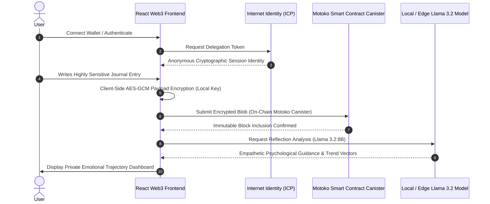

## Overview

**Moodyan** is a Web3-native mental wellness application designed for users who require absolute data sovereignty and cryptographic privacy for their personal reflections. Awarded **1st Place** at the _ICP Indonesia Hackathon_ (Team _Hackathon Dadakan_), Moodyan replaces centralized cloud surveillance with encrypted on-chain storage on the Internet Computer Protocol (ICP) and localized sentiment inference via Llama 3.2.

---

## Cryptographic Security & Reflection Workflow

The core user journey prioritizes zero-knowledge privacy from the moment a user authenticates. The sequence below details the client-side AES-GCM encryption handshake, decentralized canister consensus, and localized LLM inference.



Because payload encryption occurs exclusively in the browser before network transmission, neither the blockchain nodes nor network sniffers can decipher user journal contents. Localized AI models interpret sentiment directly on the client machine to generate private wellness insights.

---

## Canister & Smart Contract Architecture

Moodyan partitions its decentralized infrastructure across specialized Internet Computer canisters to separate authentication, persistent storage, and cryptographic key derivations.

```mermaid
graph TD
    subgraph Client Tier
        A[React + Vite Web3 Client] --> B[ICP Agent-JS Integration Layer]
    end

    subgraph Internet Computer Network (ICP Canisters)
        C[Internet Identity Authentication Canister]
        D[Journal Storage & State Canister - Motoko]
        E[Access Control & Cryptographic Canister]
    end

    subgraph Edge Intelligence Tier
        F[Llama 3.2:8B Sentiment Analysis Engine]
    end

    B -->|Zero-Knowledge Auth Handshake| C
    B -->|Encrypted State Mutate/Query| D
    B -->|Session Key Pair Derivation| E
    B -->|Client-Side Inference RPC| F
```

This multi-canister architecture enforces strict caller verification through cryptographic principal identities. Canister memory structures in Motoko provide sub-second query speeds while guaranteeing permanent, tamper-resistant history.

---

## Key Architectural Decisions

- **Zero-Knowledge Authentication**: Utilized Internet Identity to provide cryptographic authentication without collecting personally identifiable information (PII) such as emails, names, or phone numbers.
- **Client-Side AES-GCM Encryption**: Enforced end-to-end payload encryption on the client prior to blockchain submission, ensuring smart contracts only ever store opaque ciphertext.
- **Canister State Management**: Implemented high-efficiency smart contracts in Motoko to manage decentralized data partitioning, caller access controls, and cross-canister calls.
- **Localized Sentiment Intelligence**: Integrated Llama 3.2:8B for deep contextual mood categorization, providing empathetic, actionable feedback without leaking unencrypted text to external APIs.
