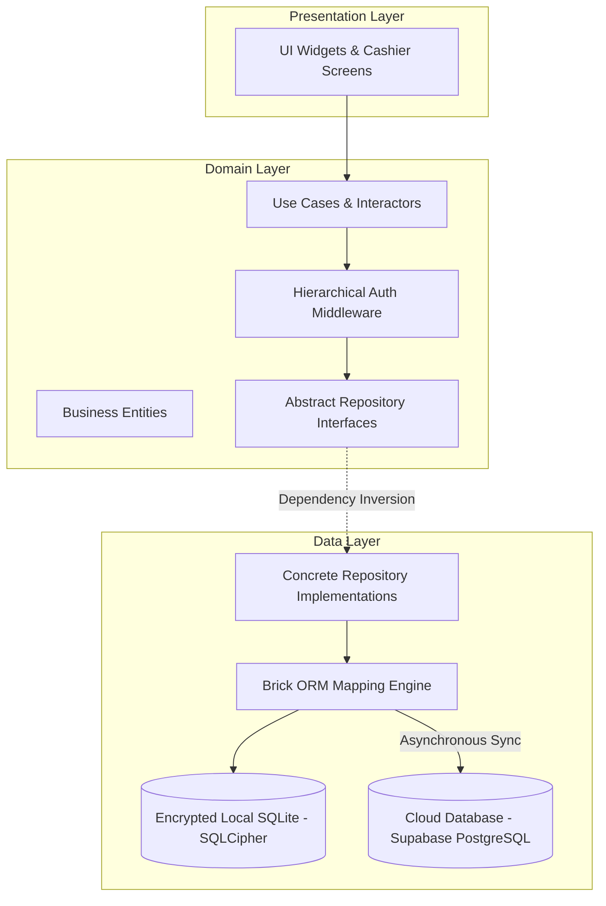
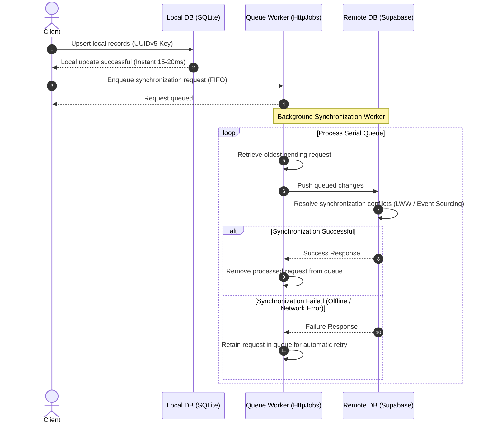
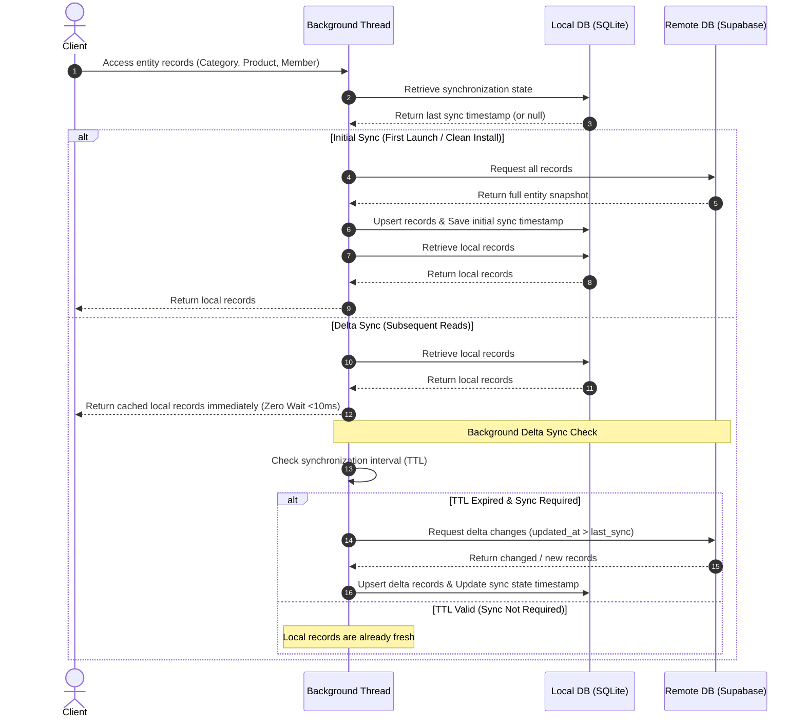
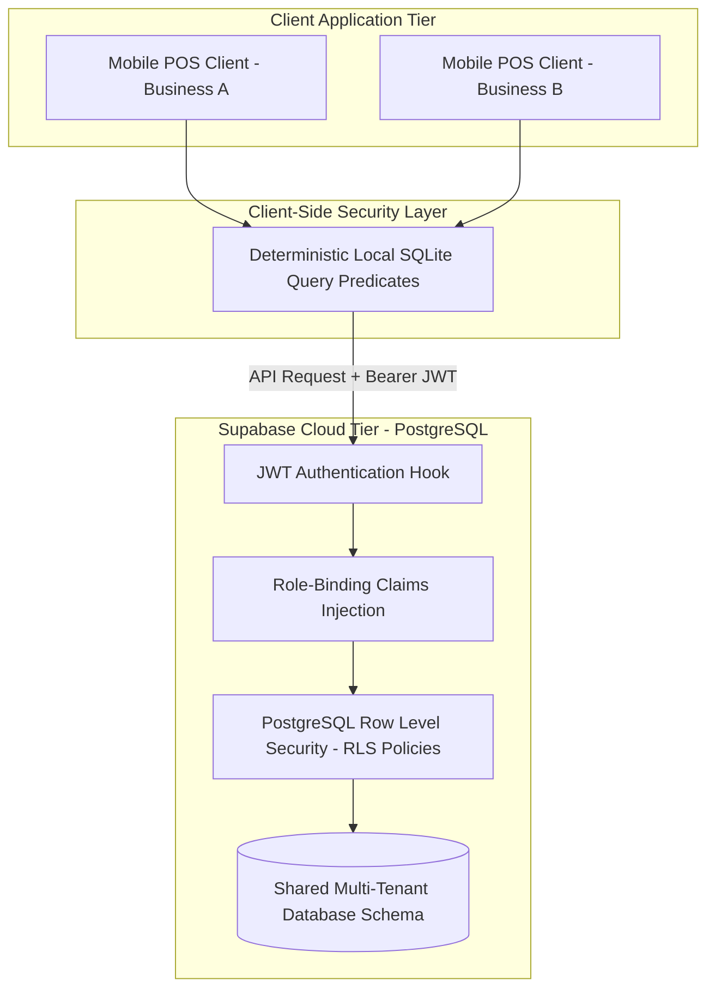

## Overview

**Niagara POS** is an enterprise-grade, offline-first Point of Sale (POS) and inventory management system designed for multi-branch retail and F&B MSMEs. Engineered upon **Clean Architecture** principles, the platform directly orchestrates Backend-as-a-Service (Supabase / PostgreSQL) from the mobile client, eliminating the latency and maintenance overhead of intermediate middleware servers.

The architectural design and empirical validation of Niagara POS are published in _Buletin Teknologi Informasi_ under the title **"Domain and Data Layer Design for Offline-First Multi-Tenant POS with BaaS Integration"** (Bayu Rizky Kurnia Pratama et al., Universitas Udayana & Politeknik Negeri Bali).

---

## 1. Client-Side Clean Architecture & Layer Decoupling

The platform isolates pure business logic from database and network infrastructure by establishing a strict boundary between the Domain and Data layers.

This decoupled design ensures the Domain Layer processes business use cases independently, returning standardized Result objects to the Presentation Layer without direct coupling to database drivers. The Data Layer encapsulates all schema transformations, encryption, and network synchronization mechanics.

---

## 2. Push Synchronization Workflow (Mutations & FIFO Queue)

When cashiers execute sales, inventory adjustments, or catalog changes, mutations are instantly written to the local SQLite database and stamped with deterministically generated **UUIDv5** identifiers to mathematically eliminate primary key collisions. Synchronization payloads are then processed sequentially through a local First-In-First-Out (FIFO) queue (`HttpJobs`).

By delegating network transmissions entirely to a background serial queue, local write latency remains constant between 15 to 20 milliseconds even during severe network degradation (300ms latency with 15% packet loss). The queue strictly processes payloads sequentially to preserve chronological ordering across related transactional mutations.

---

## 3. Pull Synchronization Workflow (TTL-Based Delta Sync)

To maintain catalog freshness across multi-branch environments without saturating mobile bandwidth, Niagara POS implements a Time-To-Live (TTL) delta synchronization engine.

During subsequent read operations, the application serves local cached records in under 10 milliseconds. If the local Time-To-Live interval has expired, the background thread retrieves only records modified after the last recorded synchronization timestamp, updating the local database without UI freezing.

---

## 4. Multi-Tenant Data Isolation (Shared Database, Shared Schema)

Multi-tenant security is enforced at both cloud and client boundaries to prevent data leakage across distinct business entities (`business_id`) and branch locations (`branch_id`).

At the cloud level, a custom PostgreSQL authentication hook injects tenant role-binding claims into user JWTs, allowing Row Level Security (RLS) policies to intercept and reject cross-tenant queries natively at the database engine level. On the client device, deterministic filtering predicates are injected into every SQLite query execution to prevent cross-tenant exposure on shared hardware.

---

## Key Architectural Decisions & Empirical Findings

- **Hybrid Conflict Resolution Engine**:
  - **Last Write Wins (LWW)**: Applied to general master entities (categories, product details) using chronological `updated_at` timestamps.
  - **Event Sourcing Pattern**: Applied to cumulative entities susceptible to race conditions (stock movements, loyalty points) by recording state changes as immutable entries in dedicated ledger tables (`stock_movements`).
  - **Deterministic UUIDv5 Generation**: Generates namespace-hashed primary keys on offline devices to eliminate UUID collisions during mass cloud synchronization.
- **100% Functional Pass Rate**: Validated across **325 automated test scenarios** covering 26 operational business modules using Grey Box Integration Testing with real SQLite and Supabase database instances.
- **Stable Write Latency (15–20 ms)**: Maintained flat write performance under artificially degraded network profiles (300 ms latency, 15% packet loss), significantly outperforming online-only architectures which fluctuated between 250 and 400+ ms with frequent connection dropouts.
- **Zero-Loss Extreme Recovery**: Evaluated under extreme offline conditions by accumulating **1,000 offline sales transactions** (over **5,000 discrete queued instructions**). Upon network restoration, the queue drained in ~600 seconds with an **absolute 0% data loss record** (1,010 local transactions perfectly reconciled with 1,010 Supabase cloud records).
- **Embedded SQLCipher Storage**: Secured offline transactional records, cash drawer ledgers, and authentication tokens using 256-bit AES encryption at rest.
