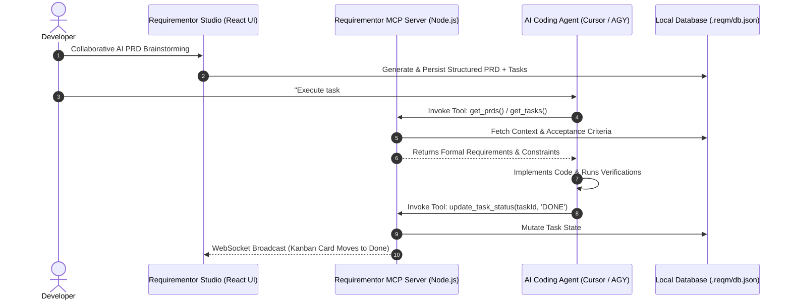
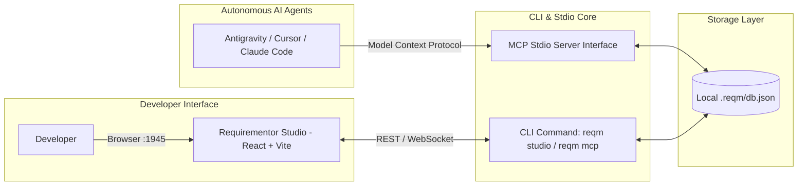

## Overview

**Requirementor** is an open-source product planning and agentic execution toolkit designed to bridge the gap between high-level architectural design and autonomous AI development. It unifies an interactive AI PRD (Product Requirements Document) studio with a live Kanban system that local AI coding agents (such as Antigravity, Cursor, Cline, and Claude Code) can read from and orchestrate autonomously through the **Model Context Protocol (MCP)**.

---

## Agentic Execution Workflow

Requirementor operates through an interactive cycle where human engineers shape formal specifications and autonomous AI coding agents retrieve, execute, and verify tasks programmatically. The sequence below demonstrates the MCP tool-calling lifecycle connecting human brainstorming to AI code generation.

Through this protocol handshake, AI agents gain full situational awareness without manual prompt copying or specification drift. Live Kanban boards update automatically as tasks transition from backlog to verified implementations.

---

## System Architecture

The Requirementor ecosystem is architected around lightweight, self-contained local developer tooling. The diagram below illustrates the relationship between the web-based Studio UI, the local MCP stdio server, and external AI agents.

This decoupled architecture allows developers to run Requirementor entirely offline with zero mandatory cloud dependencies. The local JSON persistence layer ensures instant response times and complete source control tracking within the user repository.

---

## Key Architectural Decisions

- **Direct Model Context Protocol (MCP) Integration**: Built a native MCP stdio server exposing programmatic primitives (`get_prd`, `get_tasks`, `update_task_status`, `create_task`), eliminating context-switching between human planning and agent execution.
- **RFC 2119 Compliant Spec Generator**: Engineered prompt workflows that synthesize user input into strict requirement specifications using unambiguous RFC keywords (_MUST_, _SHALL_, _SHOULD_).
- **Embedded Diagram Rendering**: Built native parser integrations for Mermaid.js diagrams, allowing developers and AI agents to visualize entity-relationship schemas and sequence workflows directly inside markdown PRDs.
- **Zero-Cloud Local State Machine**: Stored all project PRDs, user stories, and task matrices in a human-readable `.reqm/db.json` database committed directly to the project Git repository.
