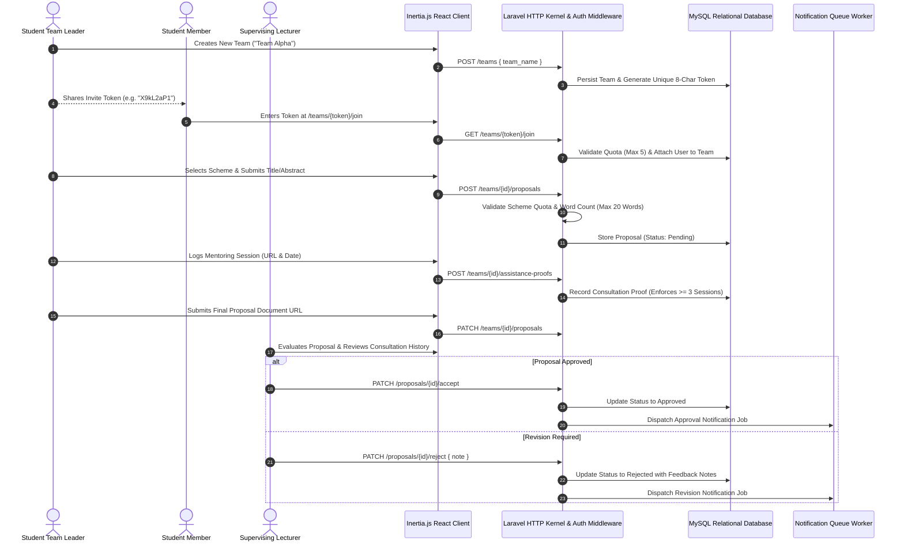
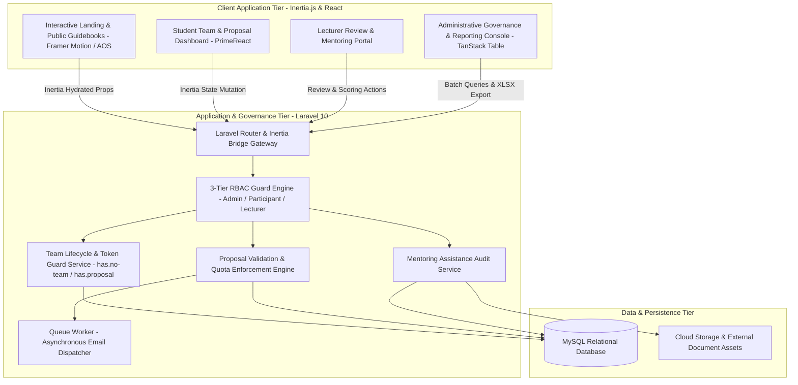

## Overview

**SIM-PKMTI** (_Sistem Informasi Pelatihan Program Kreativitas Mahasiswa Teknologi Informasi_) is an academic competition governance and student mentorship platform developed for the Information Technology Student Association (HMTI), Udayana University. Engineered as a full-stack monolithic Single Page Application (SPA) pairing **Laravel 10** with **Inertia.js** and **React 18**, the system manages the end-to-end operational lifecycle for annual PKM research training: token-based student team formation, multi-scheme proposal submissions (PKM-GFT, PKM-K, PKM-KC, PKM-PI, PKM-PM) with strict quota enforcement and word count validation, lecturer consultation tracking, and multi-factor student qualification assessments.

---

## Proposal & Mentorship Lifecycle Workflow

The platform coordinates the entire student journey from self-assembled team creation and quota-validated proposal drafting to supervising lecturer mentoring logs and final evaluation. The sequence below details this end-to-end lifecycle.

By enforcing strict prerequisites across each stage, the system ensures that teams complete mandatory lecturer mentoring checkpoints before their final proposals can be reviewed and approved.

---

## Full-Stack Monolithic SPA Architecture

SIM-PKMTI is architected as an Inertia.js monolithic single-page application, seamlessly bridging the Laravel backend kernel with a component-driven React presentation layer without requiring a separate REST API gateway.

This decoupled frontend-backend pairing within a unified monolith reduces network roundtrips and simplifies authorization checks via Laravel's native session middleware while maintaining a responsive, desktop-like user interface.

---

## Key Architectural Decisions

- **Inertia.js Monolithic SPA Architecture**: Eliminated client-server REST boilerplate and duplicated TypeScript/DTO models by using Inertia.js as a seamless bridge between Laravel 10 backend controllers and client-side React 18 view components.
- **Token-Driven Dynamic Team Lifecycle**: Designed a secure 8-character token invitation protocol that handles self-service team formation (3–5 members), leader delegation, member removal, and cascading automatic dissolution when single-member teams disband.
- **Multi-Scheme Proposal Rule Engine**: Enforced regulatory compliance with official Belmawa PKM guidelines through custom validation rules (`ValidProposalScheme`, `MaxWordCount`) and strict capacity caps (such as limiting the competitive PKM-GFT scheme to a maximum of 5 teams).
- **Milestone-Based Assistance Verification**: Established a prerequisite consultation checkpoint mandating teams to record at least three verified mentoring sessions with their designated lecturer before unlocking final submission clearance.
- **Multi-Factor Administrative Qualification Matrix**: Engineered an automated qualification pipeline that audits participant status against a 5-point completion matrix (team enrollment, lecturer assignment, proposal approval, final document submission, and &ge;3 assistance logs) for automated graduation assessment and spreadsheet generation.
