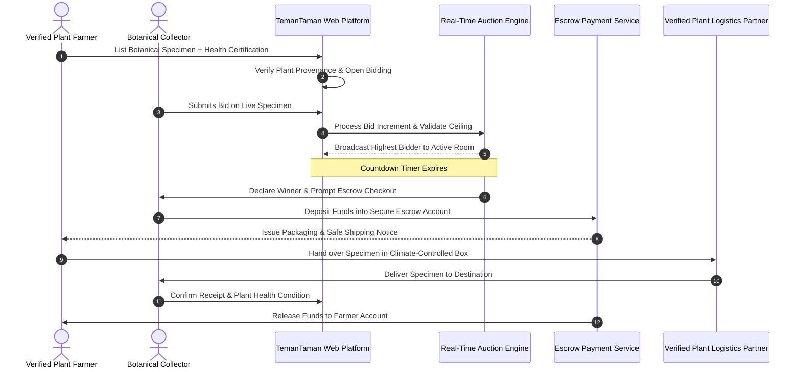
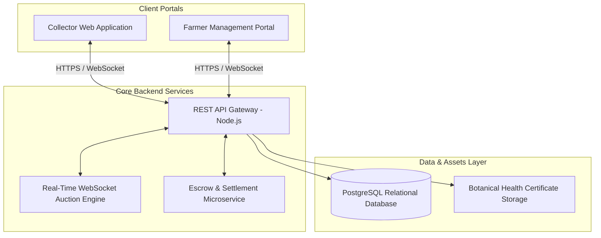

## Overview

**TemanTaman** is an auction-based digital marketplace platform engineered to modernize supply chains and fair price discovery for ornamental plant farmers and botanical collectors. Addressing high intermediary margins, fragmented regional access, and the unique logistics of living plants, TemanTaman was awarded **3rd Place** at the _PNB IT Business Development Competition #16_.

---

## Auction & Escrow Settlement Workflow

The platform pairs real-time competitive bidding with escrow-backed financial security to protect both botanical sellers and buyers. The sequence diagram below traces the complete lifecycle from specimen certification and live bidding increments to climate-controlled logistics and escrow fund release.

This milestone-driven escrow protocol eliminates payment fraud and guarantees that rare living specimens arrive in verified healthy condition before transactions finalize. Real-time WebSocket broadcasting ensures bidding transparency across nationwide collector rooms.

---

## System Architecture

TemanTaman is structured as a distributed web application separating real-time auction event processing from traditional marketplace management portals.

This architecture separates high-frequency WebSocket bid broadcasts from core transactional billing routines, preventing auction concurrency spikes from degrading platform stability. PostgreSQL stores relational audit trails for all bids, shipments, and health certificates.

---

## Key Architectural Decisions

- **Market-Driven Price Discovery**: Implemented a real-time WebSocket bidding engine that connects growers directly with nationwide collectors, eliminating predatory intermediary commissions.
- **Escrow-Protected Financial Safeguards**: Designed a milestone-based escrow settlement architecture where funds are only disbursed once the collector verifies live plant health upon delivery.
- **Botanical Provenance Certification**: Created standardized inspection metadata tracking root stability, variegation genetics, and pest-free health certifications.
- **Logistics Integration Protocol**: Engineered packaging compliance guidelines and courier routing algorithms optimized for temperature-sensitive botanical transport.
